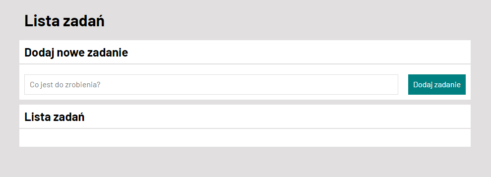

# To do List

## Demo
https://yamaha3003.github.io/To-do-list/
## Descryption
This is simple tasks lis
with the help of this program you can:
1. Add new tasks
2. Mark as done
3. Remove done tasks
## Applied technologies
- HTML
- CSS
- JavaScript	
- BEM
- Grid
- Media queries
